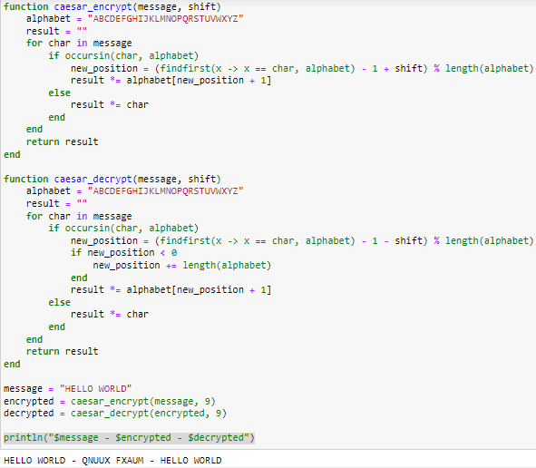
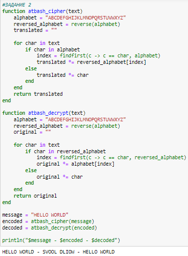

---
## Front matter
lang: ru-RU
title: Презентация по лабораторной работе
subtitle: Математические основы защиты информации и информационной безопасности
author:
  - Быстров Г. А.
institute:
  - Российский университет дружбы народов, Москва, Россия
date: 14 сентября 2024

## i18n babel
babel-lang: russian
babel-otherlangs: english

## Formatting pdf
toc: false
toc-title: Содержание
slide_level: 2
aspectratio: 169
section-titles: true
theme: metropolis
header-includes:
 - \metroset{progressbar=frametitle,sectionpage=progressbar,numbering=fraction}
---

## Цели и задачи

- Научиться программировать на языке Julia.
- Узнать как работает шифр Цезаря и шифр Атбаш.

## Выполнение лабораторной работы

1. Реализовал на языке Julia шифр Цезаря с произвольным ключом k(рис. [-@fig:001]).

{#fig:001 width=70%}

## Выполнение лабораторной работы

2. Реализовал на языке Julia шифр Атбаш (рис. [-@fig:001]).

{#fig:001 width=70%}

## Результаты

Успешно удалось научиться программировать на языке Julia и узнать как работает шифр Цезаря и шифр Атбаш.
